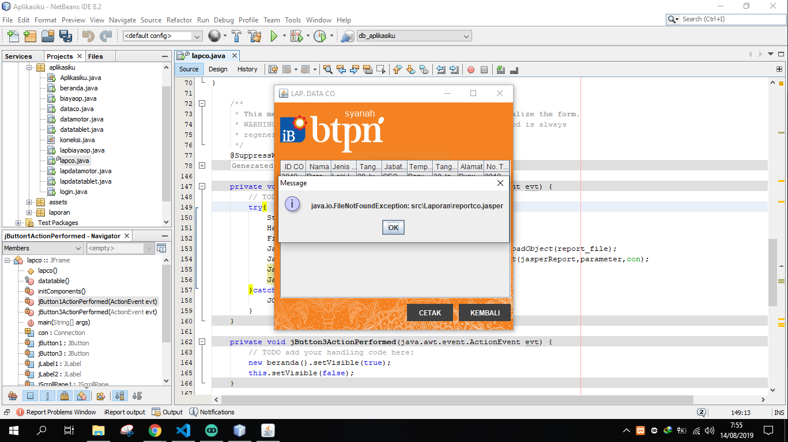

## The core problem

```java
try{
    String namaFile ="src/Laporan/reportco.jasper";
    HashMap parameter = new HashMap();
    File report_file = new File (namaFile);
    JasperReport jasperReport = (JasperReport) JRLoader.loadObject(report_file);
    JasperPrint jasperPrint = JasperFillManager.fillReport(jasperReport,parameter,con);
    JasperViewer.viewReport(jasperPrint,false);
    JasperViewer.setDefaultLookAndFeelDecorated(true);
}catch (JRException e){
    JOptionPane.showMessageDialog(null, e.getMessage());
}
```

The code above is the standard code for calling iReport on Java Netbeans, there are lots of tutorial sites that suggest that code. However, there is an error that I think is the most fatal in the section `File report_file = new File (filename);`.

When the application / program run through Netbeans, the calling script it works fine. However, when an application / program you are already diexectuble into a Jar file, the script was not functioning at all and the error message `java.io.FileNotFoundException` which means you jasper file not found.



## Troubleshooting

To solve this problem you have to replace the fatal part as follows.

```java
try{
    // String namaFile ="src/Laporan/reportco.jasper";
    HashMap parameter = new HashMap();
    // File report_file = new File (namaFile);
    InputStream report_file = getClass().getResourceAsStream("/src/Laporan/reportco.jasper");
    JasperReport jasperReport = (JasperReport) JRLoader.loadObject(report_file);
    JasperPrint jasperPrint = JasperFillManager.fillReport(jasperReport,parameter,con);
    JasperViewer.viewReport(jasperPrint,false);
    JasperViewer.setDefaultLookAndFeelDecorated(true);
}catch (JRException e){
    JOptionPane.showMessageDialog(null, e.getMessage());
}
```
