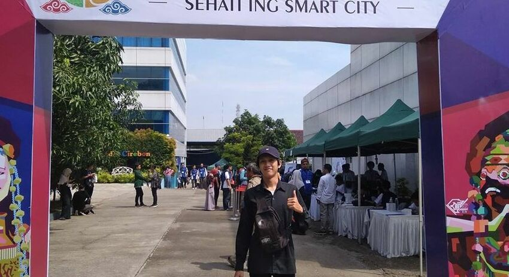

Saya merupakan seorang lelaki beruntung kelahiran Banyumas, 30 Januari, dengan nama asli Razaqul Akli Tegar Ardiansyah. Lulusan Rekayasa Perangkat Lunak di salah satu Sekolah Kejuruan Negeri yang ada di Purwokerto, dan sekarang saya sedang menempuh karir profesional sebagai Full Stack Developer.

Selain duduk di depan laptop, saya juga kerap berkegiatan alam terbuka dan sesekali menangkap gerak dengan kamera ponsel.

## Podcast
* [Antara Anak Muda, Narkoba, Kopi-Senja, dan Karir](spotify:episode:7g9nSeHXUt9jxIvxmShoux)

## Portfolio
* 2017 - Alzheimer Indonesia `Web Design`
* 2017 - KPU Banyumas `Web Development`
* 2018 - Navis Galeri `Web Development`
* 2018 - Inovasi Desa `Web Design`
* 2019 - Panda SID `App Development`
* 2019 - Dumoro `Web Development`
* 2019 - The Jakmania Purwokerto `App Development`
* 2019 - BTPN Syariah `App Development`
* 2020 - Sensus Penduduk Online ``
* 2020 - Hooligans Indonesia Store `Web Design`
* 2020 - Pertamina EP `App Development`
* 2020 - Covid 19 Indonesia `Web Development`

## Sedang Menggunakan

* Laptop: Acer Aspire E14 (Intel Core i3, RAM 6GB, dan HDD 500GB)
* Hosting: [Netlify](https://netlify.com/) dan [Domainesia](https://domainesia.com/)
* Generator Situs Statis:  [Gatsby](https://gatsbyjs.org/)
* Daftar tool yang saya pakai bisa di lihat [disini](/tool/)

## [Download Resume](/resume.pdf)