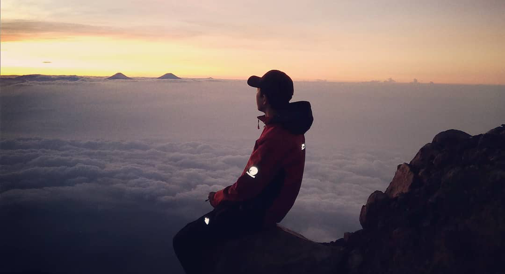

Saya merupakan seorang lelaki beruntung kelahiran Banyumas, 30 Januari dengan nama asli Razaqul Akli Tegar Ardiansyah. Lulusan Rekayasa Perangkat Lunak di salah satu sekolah kejuruan negeri yang ada di Purwokerto, dan sekarang saya sedang menempuh karir profesional sebagai Junior Full Stack Developer.

Selain bekerja, saya juga kerap berkegiatan alam terbuka dan sesekali menangkap gerak dengan kamera ponselnya.

## Podcast
* [Antara Anak Muda, Narkoba, Kopi-Senja, dan Karir](spotify:episode:7g9nSeHXUt9jxIvxmShoux)

## Portfolio
* [Panda SID](https://www.panda.id/) - Sistem Informasi Desa Terintegrasi
* [Dumoro](https://www.puskomedia.id/dumoro/) - Platfrom Toko Online
* [KPU Banyumas](http://kab-banyumas.kpu.go.id/) - Web Development KPU Kab. Banyumas
* [Inovasi Desa](https://inovasidesa.kemendesa.go.id/) - Web Development Inovasi Desa dari Kemendesa
* [Alzheimer Indonesia](https://www.alzi.or.id/) - Web Development Organisasi penderita Dementia/Alzheimer Indonesia
* [Navis Galeri](https://navis.co.id/) - Web Development E-Commerce busana muslim

## Sedang Menggunakan

* Laptop: Acer Aspire E 14 (Intel® Core™ i3, Intel® HD Graphics 4400, 6 GB DDR3 Memory, dan 500 GB HDD)
* Hosting: [Netlify](https://netlify.com/)
* Static Site Generator:  [Gatsby](https://gatsbyjs.org/)
* Daftar tool yang saya pakai bisa di lihat [disini](/tool/)