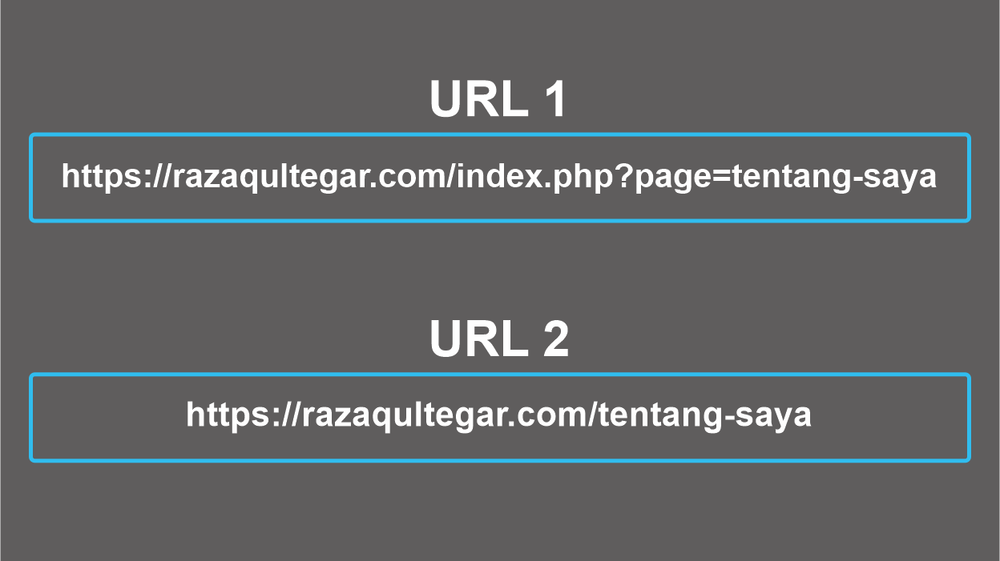

## Apa itu SEO?

Optimisasi mesin pencari atau Search Engine Optimization, biasa disingkat "SEO" adalah serangkaian proses yang dilakukan secara sistematis yang bertujuan untuk meningkatkan kualitas trafik kunjungan melalui mesin pencari menuju situs web tertentu dengan memanfaatkan mekanisme kerja atau algoritma mesin pencari tersebut.

Tujuan dari SEO adalah menempatkan sebuah situs web pada posisi teratas, atau setidaknya halaman pertama hasil pencarian berdasarkan kata kunci tertentu yang ditargetkan. Secara logis, situs web yang menempati posisi teratas pada hasil pencarian memiliki peluang lebih besar untuk mendapatkan pengunjung.

## Contoh Permalink SEO Friendly



Keterangan : pada contoh nomor satu itu merupakan permalink yang salah atau tidak SEO Friendly, sedangkan contoh nomor dua itu adalah contoh permalink SEO Friendly.

## Lalu bagaimana cara membuatnya?

Berikut saya kasih contoh bagaimana membuat sebuah permalink yang SEO Friendly menggunakan PHP dan tanpa setting htaccess.

```php
function SefLink($str){
  // Mengubah teks menjadi huruf kecil dan ke format UTF-8.
  $str = mb_strtolower($str, 'UTF-8');
  // Mengubah karakter yang tidak normal menjadi tanda hubung.
  $str = preg_replace('/[^a-z0-9]/','-',$str);
  // Mencegah menerima beberapa tanda hubung
  $str = preg_replace('/-+/','-',$str);
  // Hapus tanda hubung kanan dan kiri
  return trim($str, '-');
}
```